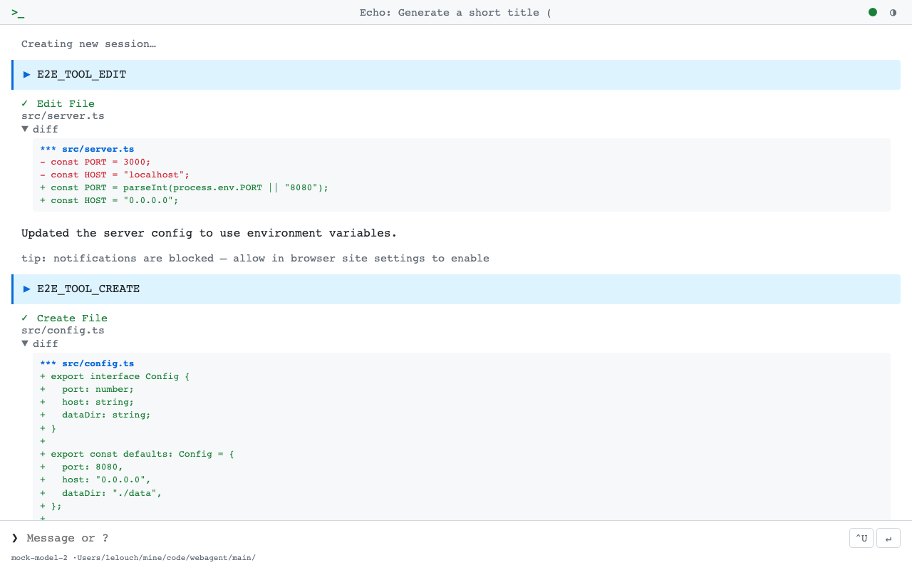
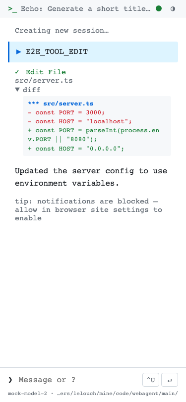
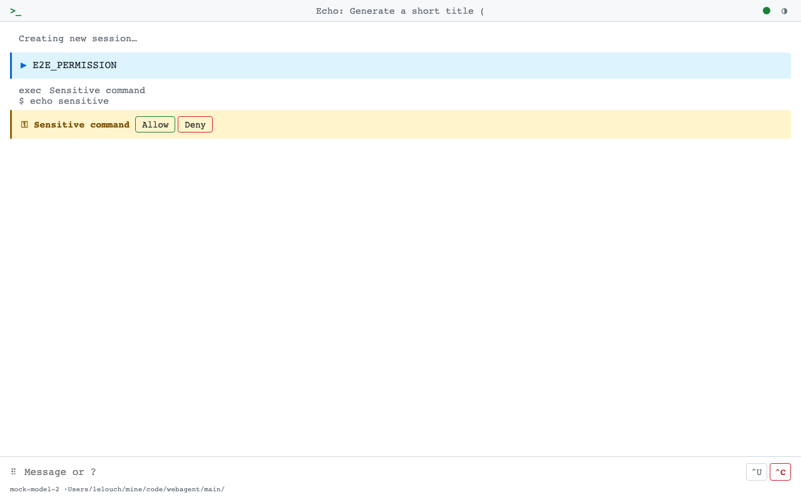
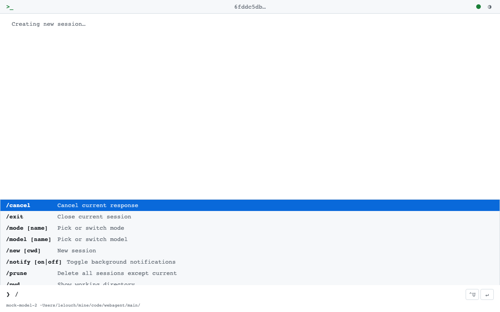

# WebAgent

[](https://github.com/LelouchHe/webagent/actions/workflows/ci.yml)
[](https://www.npmjs.com/package/@lelouchhe/webagent)

A terminal-style web UI for [ACP](https://agentclientprotocol.com/)-compatible agents — Copilot CLI, Claude Code, Gemini CLI, and [more](docs/configuration.md#acp-compatible-agents).

<table>
  <tr>
    <td width="60%">
      
    </td>
    <td width="40%">
      
    </td>
  </tr>
</table>

<details>
<summary>More screenshots</summary>

<table>
  <tr>
    <td width="50%">
      
      <br /><sub>Inline permission prompts, synced across devices.</sub>
    </td>
    <td width="50%">
      
      <br /><sub>Slash command autocomplete menu.</sub>
    </td>
  </tr>
</table>

</details>

## Quick Start

**Prerequisites:** Node.js 22.6+, an ACP-compatible agent installed and authenticated.

```bash
npm install -g @lelouchhe/webagent
webagent                                     # start on port 6800
webagent --config /path/to/config.toml       # custom config
```

Or run directly: `npx @lelouchhe/webagent`

Data (SQLite database, uploaded images) is stored in `./data/` by default. See [Configuration & Operations](docs/configuration.md) for daemon mode, TOML settings, and agent setup.

## Architecture

```
Browser ←── REST + SSE ──→ Server ←── ACP ──→ Agent CLI
  (thin client)            (Node.js)           (copilot/claude/gemini)
```

The frontend is a standard browser client that talks to the server over REST + SSE. The API is the boundary — anyone can build their own client.

| Module | Role |
|---|---|
| `routes.ts` | REST API + static files ([full API reference](docs/api.md)) |
| `event-handler.ts` | ACP event routing → SSE broadcast |
| `session-manager.ts` | Session state, buffers, bash processes |
| `bridge.ts` | ACP bridge — agent subprocess lifecycle |
| `store.ts` | SQLite persistence (WAL mode) |
| `daemon.ts` | Background service with crash recovery |

Tech stack: Node.js + TypeScript (`--experimental-strip-types`), SQLite (`better-sqlite3`), Zod validation, esbuild bundling.

Frontend source lives in `public/js/*.ts`, bundled by esbuild into a single content-hashed JS file. See [Client Architecture](docs/client-architecture.md).

## Documentation

| Document | Contents |
|---|---|
| **[Features](docs/features.md)** | Chat, images, bash, sessions, slash commands, keyboard shortcuts, themes |
| **[Configuration & Operations](docs/configuration.md)** | TOML config, daemon commands, agent setup, upgrading |
| **[API Reference](docs/api.md)** | REST endpoints, SSE events, implementation details |
| **[ACP Integration](docs/acp.md)** | Client extensions, protocol scope, current limits |
| **[Client Architecture](docs/client-architecture.md)** | Frontend modules, data flow, conventions |
| **[Development](docs/development.md)** | Building from source, dev mode, testing, publishing |
| **[Auto-Start on Boot](docs/autostart.md)** | launchd, systemd, crontab, Windows Task Scheduler |
