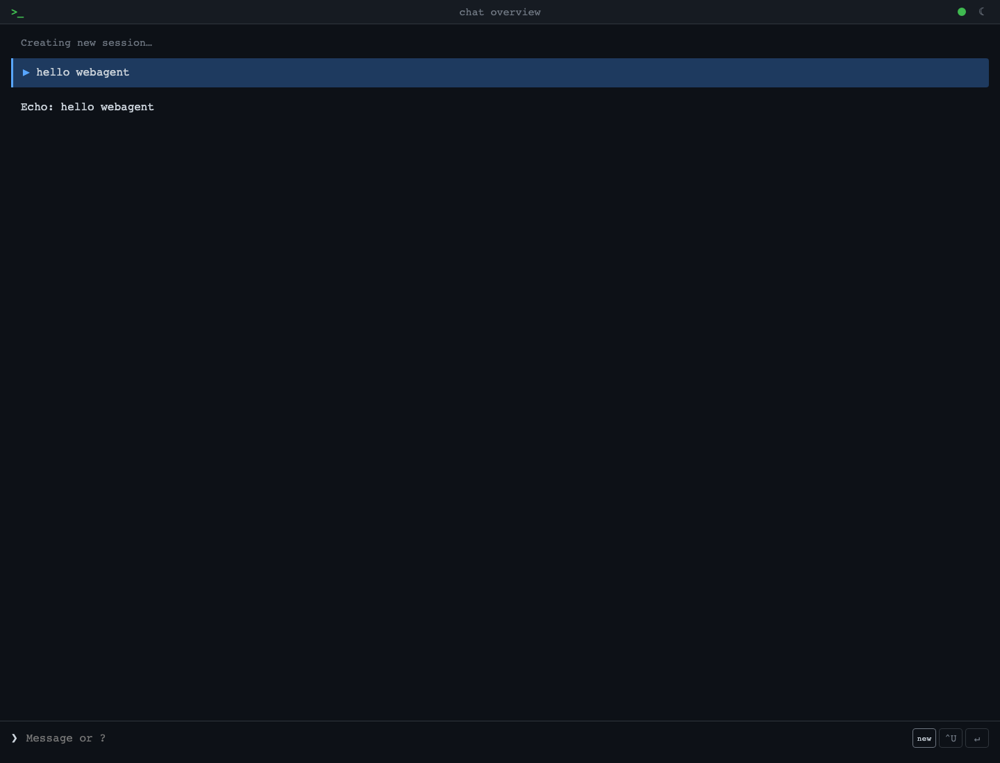
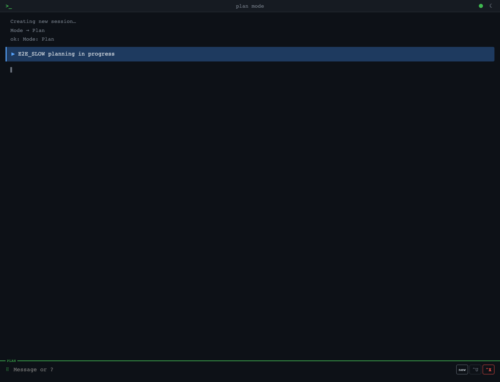
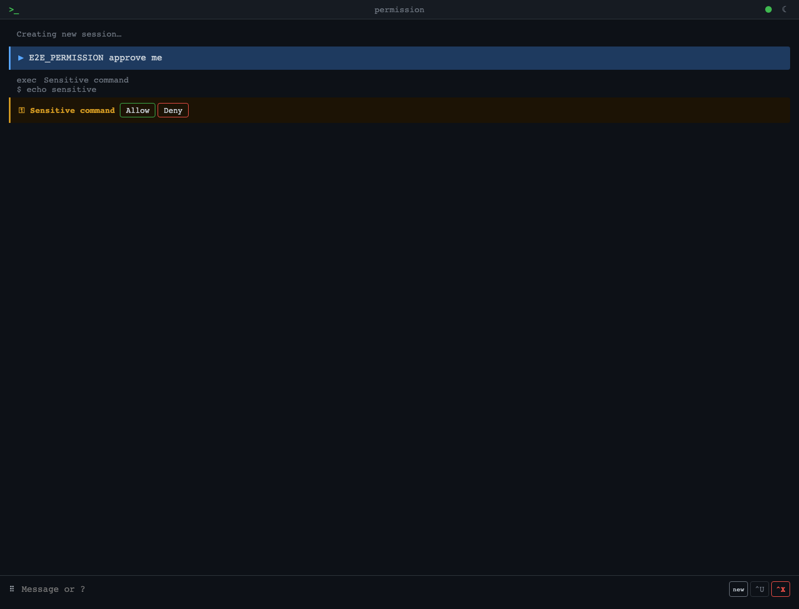
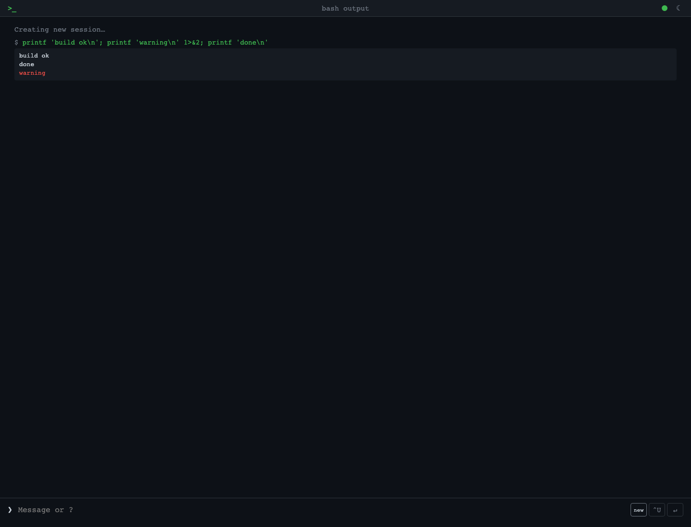
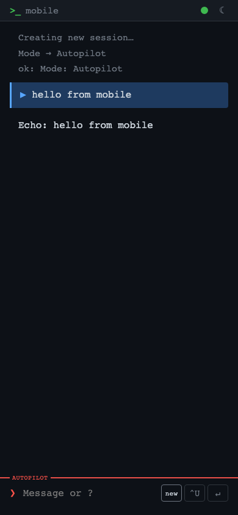

# WebAgent

[](https://github.com/LelouchHe/webagent/actions/workflows/ci.yml)
[](https://www.npmjs.com/package/@lelouchhe/webagent)

A terminal-style web UI for ACP-compatible agents.

Tech stack: Node.js + TypeScript (`--experimental-strip-types`), real-time WebSocket communication (`ws`), SQLite persistence (`better-sqlite3`), Zod validation.

## Screenshots

<table>
  <tr>
    <td width="50%">
      
      <br />
      <sub>Streaming chat in the terminal-style desktop layout.</sub>
    </td>
    <td width="50%">
      
      <br />
      <sub>Plan mode highlighted while a turn is still running.</sub>
    </td>
  </tr>
  <tr>
    <td width="50%">
      
      <br />
      <sub>Permission prompts stay inline in the conversation flow.</sub>
    </td>
    <td width="50%">
      
      <br />
      <sub><code>!&lt;command&gt;</code> output streams directly into the session.</sub>
    </td>
  </tr>
</table>

<p align="center">
  
  <br />
  <sub>Compact mobile layout with mode highlighting and terminal-style action keys.</sub>
</p>

## Prerequisites

- Node.js 22.6+ (requires `--experimental-strip-types`)
- An ACP-compatible agent installed and authenticated

### ACP-Compatible Agents

WebAgent works with any agent that implements the [Agent Client Protocol](https://agentclientprotocol.com/). Some options:

| Agent | Command | Notes |
|---|---|---|
| [Copilot CLI](https://github.com/github/copilot-cli) | `copilot --acp` | Default. GitHub's AI pair programmer |
| [Claude Code](https://docs.anthropic.com/en/docs/agents/claude-code) | `claude --acp` | Anthropic's coding agent |
| [Gemini CLI](https://github.com/google-gemini/gemini-cli) | `gemini --acp` | Google's Gemini models |
| [OpenCode](https://opencode.ai/) | `opencode --acp` | Open-source, extensible |

See the [ACP Registry](https://agentclientprotocol.com/get-started/agents) for the full list. To use a different agent, set `agent_cmd` in your config:

```toml
agent_cmd = "claude --acp"
```

## Install

```bash
npm install -g @lelouchhe/webagent
```

Or run directly with npx:

```bash
npx @lelouchhe/webagent
```

## Run

```bash
webagent                             # start with defaults (port 6800)
webagent --config /path/to/config.toml   # start with custom config
```

Data (SQLite database, uploaded images) is stored in `./data/` relative to your current working directory by default.

### From source

```bash
git clone https://github.com/LelouchHe/webagent.git
cd webagent
npm install
npm run build         # build static assets (public/ → dist/)
npm start             # start on port 6800
```

### Development

```bash
npm run dev           # port 6801, uses data-dev/, auto-restarts on file changes
```

### Service management

WebAgent includes a built-in daemon with crash recovery:

```bash
webagent start --config config.toml   # start as background daemon
webagent stop                          # stop the daemon
webagent restart                       # atomic restart (Unix) / stop+start (Windows)
webagent status                        # show running state
```

The daemon writes a PID file (`webagent.pid`) and log file (`webagent.log`) in the current directory. Run all commands from the same directory.

For auto-start on boot, see [docs/autostart.md](docs/autostart.md) (launchd, systemd, crontab, and Windows Task Scheduler examples).

### Configuration

Configuration is via TOML files, passed with `--config`:

```bash
webagent --config config.toml
```

If no `--config` is provided, all settings use built-in defaults. See `config.toml` for the checked-in default settings and `config.dev.toml` for development.

| Key | Default | Description |
|---|---|---|
| `port` | `6800` | HTTP/WebSocket server port |
| `data_dir` | `data` | SQLite + uploads directory |
| `default_cwd` | `process.cwd()` | Working directory for new sessions |
| `public_dir` | `dist` | Static assets directory |
| `agent_cmd` | `copilot --acp` | ACP agent command (binary + args, space-separated) |
| `limits.bash_output` | `1048576` (1 MB) | Max bash output stored in DB per command |
| `limits.image_upload` | `10485760` (10 MB) | Max image upload size |
| `limits.cancel_timeout` | `10000` (10s) | Cancel timeout in ms; 0 disables |
| `push.vapid_subject` | `mailto:webagent@localhost` | VAPID subject for Web Push (email or URL) |

To use a different ACP-compatible agent backend:

```toml
agent_cmd = "my-agent --acp"
```

## Features

### Chat

- Real-time streaming responses with Markdown rendering + syntax highlighting
- Collapsible thinking process display
- Tool call display (status animation, expandable details, diff rendering)
- Agent execution plan display (pending ○ / in-progress ◉ / done ●)
- Permission confirmation dialog for sensitive operations (Allow / Deny), synced across devices; auto-approved in autopilot mode
- Smart scroll: force-scrolls on load/switch/send, soft auto-scroll during streaming

### Images

- Upload images (button or `^U` shortcut)
- Paste images (Ctrl+V / Cmd+V)
- Preview before sending + removable, supports multiple images
- Server-side storage, displayed inline in chat

### Bash Execution

- `!<command>` to run shell commands directly
- Real-time output streaming (stderr in red)
- Collapsible output with exit code display
- Cancel running processes
- Cancel is session-scoped inside WebAgent: it stops the current ACP turn plus WebAgent-owned session work (like local `!` bash), but it cannot stop host-level tasks started outside the WebAgent server/runtime

### Session Management

- Auto-resumes last session on page open, no manual switching needed
- After server restart, restores session context via ACP `loadSession` so conversations can continue
- Auto-generated titles (async, using a fast model)
- Session history persisted in SQLite, survives restarts
- `/sessions` lists all sessions (git-branch style, `*` marks current in green)
- Switching sessions replays full message history

### Slash Commands

Type `/` to trigger an autocomplete menu with arrow keys to navigate, Esc to close.

| Key | In menu | Without menu |
|---|---|---|
| `Tab` | Fill selected item into input | — |
| `Enter` | Send current input | Send current input |
| Click/Tap | Fill and send (Tab + Enter) | — |

Commands with submenus (`/model`, `/mode`, `/think`, `/notify`, `/switch`, `/delete`, `/new`) show a picker after typing the command and a space. Tab completes the selection into the input so you can review or edit before pressing Enter to send.

| Command | Description |
|---|---|
| `/new [cwd]` | Create new session (optionally specify working directory) |
| `/pwd` | Show current working directory |
| `/model [name]` | View or switch model (fuzzy match, e.g. `/model opus`) |
| `/mode [name]` | View or switch mode (Agent / Plan / Autopilot) |
| `/think [level]` | View or switch reasoning effort (low / medium / high) |
| `/notify [on\|off]` | Toggle push notifications for background alerts |
| `/cancel` | Cancel current response |
| `/switch <title\|id>` | Switch to a session (match by title or ID prefix) |
| `/delete <title\|id>` | Delete a session |
| `/prune` | Delete all sessions except current |
| `/help` | Show help |

### Keyboard Shortcuts

| Shortcut | Action |
|---|---|
| `Enter` | Send message |
| `Shift+Enter` | New line |
| `Ctrl+X` | Cancel current response |
| `Ctrl+M` | Cycle mode (Agent → Plan → Autopilot) |
| `Ctrl+U` | Upload image |

Tap the `❯` prompt indicator to cycle mode. Tap `new` to create a new session (hidden when input has content).

### Theme

- Dark / light / system, toggle with `◑`
- Terminal-style UI (monospace font, `>_` logo)
- Preference saved to localStorage

### Other

- PWA support (installable to home screen)
- Web Push notifications — background alerts when no browser tab is visible (use `/notify on`)
- WebSocket auto-reconnect (3s retry on disconnect)
- 30s heartbeat keepalive
- Auto-expanding input box
- Mobile-friendly layout
- Multi-client broadcast (events synced across devices)

## Testing

```bash
npm test              # unit + integration
npm run test:e2e      # Playwright browser E2E
```

- `TEST_SCENARIOS.md` is the scenario-level coverage map for the current suite.
- Use it when reviewing what is already protected before adding new tests or auditing gaps.
- The E2E suite now covers session lifecycle, reconnect/restart recovery, permissions, cancel flows, bash lifecycle, media persistence, slash-menu UX, config persistence/inheritance, and multi-client config behavior.

## Architecture

```
Browser ←WebSocket→ server.ts ←ACP→ copilot CLI
                     ├── routes.ts (HTTP handlers)
                     ├── ws-handler.ts (WS dispatch)
                     ├── session-manager.ts (state)
                     ├── title-service.ts (auto-title)
                     └── store.ts (SQLite)
```

- **server.ts** — HTTP/WebSocket server bootstrap
- **routes.ts** — HTTP request handlers (static files, REST API, image upload)
- **ws-handler.ts** — WebSocket message dispatch + broadcast
- **session-manager.ts** — Session state management (live sessions, buffers, bash procs, model cache)
- **bridge.ts** — ACP bridge, manages agent subprocess, handles permissions and file I/O
- **store.ts** — SQLite persistence (sessions + events tables, WAL mode)
- **title-service.ts** — Async session title generation (dedicated Haiku session)
- **types.ts** — Shared types + Zod schemas for WS messages

## ACP Scope and Current Limits

WebAgent uses ACP for the core agent loop: session creation / restore, prompt turns, permission requests, streaming updates, model selection, and text file read/write.

Current scope in this repo:

- Session lifecycle goes through ACP (`newSession`, `loadSession`, `prompt`, `cancel`)
- The UI renders a subset of ACP session updates: assistant text, thinking text, tool calls, tool call updates, and plans
- Session history is persisted locally and restored after server restart

### Client extensions

ACP allows the client to inject extra capabilities into the agent on top of its native baseline. WebAgent currently provides:

| Extension | Status | Notes |
|---|---|---|
| `fs` (readTextFile / writeTextFile) | ✅ Implemented | Agent can read/write files through the client |
| `terminal` | Declared but not wired | `!<command>` runs via the app's own local bash bridge, not ACP `terminal/*` |
| `mcpServers` | `[]` (no extras) | Agent's own MCP servers (e.g. GitHub MCP) work normally; passing `[]` means the client isn't providing additional ones |

Passing `mcpServers: []` does **not** disable MCP — the agent loads its own configured MCP servers independently. The parameter is for the client to provide _additional_ servers the agent wouldn't have on its own.

### Current limits

- The web UI does not expose native CLI command surfaces such as `/plan`, `/fleet`, `/mcp`, `/agent`, or `/skills`
- Autopilot mode is supported: permissions are auto-approved server-side using `allow_once`
- Event handling is intentionally narrower than a native CLI client; only selected ACP updates are rendered/persisted, and the silent title-generation session suppresses normal UI events
- Model switching depends on the agent's ACP implementation and currently uses the SDK's unstable session-model API
- ACP does not expose context window usage, token counts, or remaining capacity
- No method to compact or clear session context; only option is to create a new session

In practice, this means WebAgent provides a browser UI for the core ACP chat/session workflow, but not the full product surface of direct Copilot CLI or Claude Code in a terminal.
