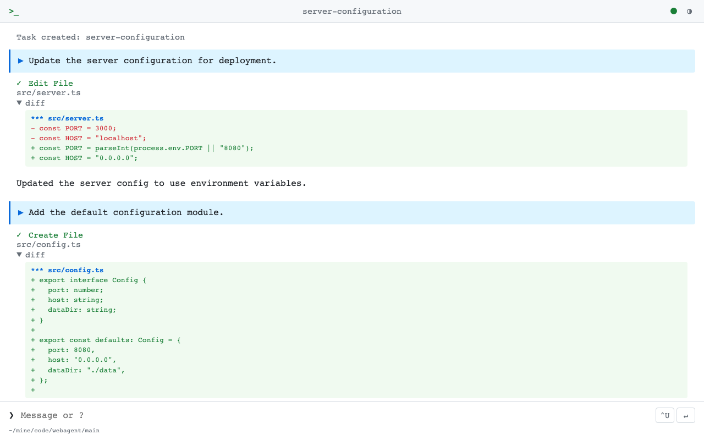
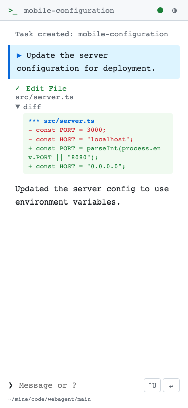
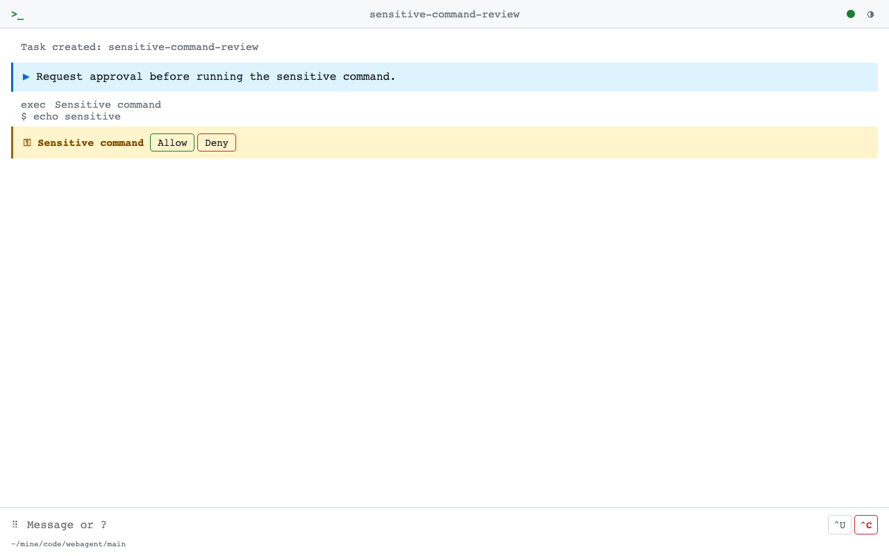
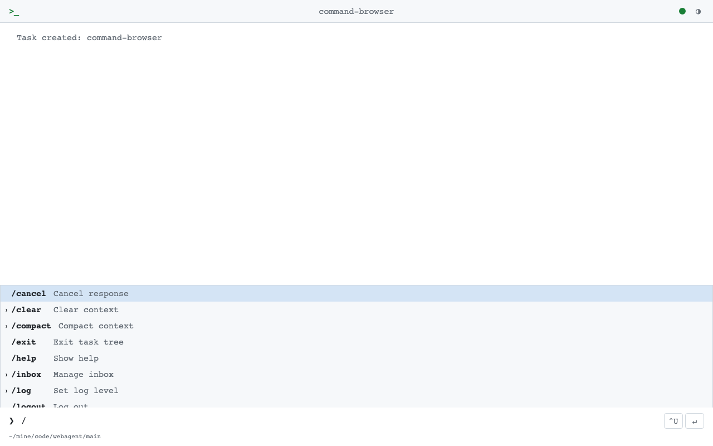

# WebAgent

[](https://github.com/LelouchHe/webagent/actions/workflows/ci.yml)
[](https://www.npmjs.com/package/@lelouchhe/webagent)

A task-first web UI for [ACP](https://agentclientprotocol.com/)-compatible agents — Copilot CLI, Claude Code, Gemini CLI, and [more](docs/configuration.md#acp-compatible-agents).

The web UI is a thin wrapper: the browser client stays small because the substance lives in the server behind it, where work is organized as **Tasks** — durable units with their own history, attachments, working directory, lifecycle, and parent/child tree. Each Task is bound to an ACP session that executes it, so a Task survives its session being resumed, rotated (`/clear`), or replaced, and Tasks work with each other by creating children, sending durable messages, and handing work back. The same model is served as a documented REST + SSE API, so anything else you build can drive it too. Nothing leaves your machine.

## Highlights

- **Task-first, thin client** — the browser is a thin wrapper over a server that treats the Task as the durable unit of work: `+api-fix` creates a named child Task, `@api-fix` opens it or sends it a message, and each Task keeps its history, working directory, and place in the tree while its agent session can be resumed, rotated, or replaced.
- **Zero-config first run** — `npx @lelouchhe/webagent` and you're online. Auto-detects the ACP agent on your `PATH`, mints an admin token on first start, persists everything in `./data/`.
- **Task-oriented API** — everything the UI does is a documented REST + SSE API: `POST /api/v1/tasks` creates a Task with a parent, title, cwd, and inherited model/mode, and every Task exposes its own event stream. Script it from CI or a cron job, or build your own client. See [Server API](docs/api.md).
- **Direct Task tools for agents (MCP)** — when the agent supports MCP, WebAgent injects a scoped `webagent` MCP server into its session, so the agent itself gets `task_create`, `task_send`, `task_update`, bounded history lookup, and child cancellation. It creates and coordinates child Tasks on its own instead of asking you to relay. See [Task MCP Control Plane](docs/task-mcp.md).
- **Multi-device, real-time** — REST + SSE keeps Tasks, permissions, collaboration messages, and bash output synced. Approve a permission on your laptop, see it confirmed on your phone.
- **Web Push notifications** — Get pinged on `prompt_done`, `permission_request`, or `bash_done` when the tab isn't focused. Smart per-task suppression: if any device is actively viewing Task X, no buzz from Task X.
- **PWA + mobile-friendly** — Installable to iOS / Android home screen. Mobile-first input, attach via paste/upload, dark-mode native.
- **Attachments** — Drag, paste, or `^U` any file (images, code, PDFs, …). Server sniffs real MIME from content, so agents reliably read it.
- **Local file viewer** — `/view` browses arbitrary local paths and renders Markdown, highlighted code/text, and images; mobile opens full-screen while desktop keeps chat in a split pane.
- **Inline bash** — `!ls -la` runs directly in your Task's cwd, output streams in real time, cancellable.
- **Tasks that survive everything** — SQLite-persisted history, auto-resume on page open, auto-restore via ACP `loadTask` after server restart, and context clearing that keeps the Task and its history intact.
- **Faithful ACP completion status** — standard `cancelled`, `max_tokens`, `max_turn_requests`, and `refusal` outcomes are shown as system notices; prompt errors are displayed and persisted without becoming assistant messages.
- **Rich slash menu** — `/new`, `/switch`, `/view`, `/model`, `/mode`, `/think`, `/notify`, `/inbox`, `/share`, `/token`, `/log` — autocomplete with Tab, submenus for pickable values.
- **Public share links** — `/share` snapshots a Task into a sanitized read-only viewer at `/s/<token>` for show-and-tell.
- **Daemon mode with crash recovery** — `webagent start` runs as a background service with PID file, log rotation, and exponential-backoff restart on crash.
- **Built-in security** — Bearer token auth, per-device tokens, signed image URLs, strict CSP, single-operator threat model.

See [Features](docs/features.md) for the full tour.

<table>
  <tr>
    <td width="60%">
      
    </td>
    <td width="40%">
      
    </td>
  </tr>
</table>

<details>
<summary>More screenshots</summary>

<table>
  <tr>
    <td width="50%">
      
      <br /><sub>Inline permission prompts, synced across devices.</sub>
    </td>
    <td width="50%">
      
      <br /><sub>Slash command autocomplete menu.</sub>
    </td>
  </tr>
</table>

</details>

## Quick Start

**Prerequisites:** Node.js 22.6+, an ACP-compatible agent installed and authenticated (Copilot CLI, Claude Code adapter, Gemini CLI, etc.).

```bash
npx @lelouchhe/webagent      # zero-install, runs on port 6800
# — or —
npm install -g @lelouchhe/webagent && webagent
```

On first run, the server prints a one-time admin token in the startup
diagnostic. Open `http://localhost:6800`, paste the token into the
login form, done. The token persists in `data/auth.json` — subsequent
runs skip the prompt.

Other ways to start:

```bash
webagent start                               # background daemon (same first-run UX in your terminal)
webagent --config /path/to/config.toml       # custom config (`webagent config init` to scaffold one)
webagent --create-token laptop               # mint extra tokens for other devices / CI
```

Data (SQLite database, uploaded files) lives in `./data/` by default. See [Configuration & Operations](docs/configuration.md) for daemon mode, TOML settings, and agent setup.

## Architecture

```
Browser ←── REST + SSE ──→ Server ←── ACP ──→ Agent CLI
  (thin client)            (Node.js)           (copilot/claude/gemini)
```

The frontend is a standard browser client that talks to the server over REST + SSE. The API is the boundary — anyone can build their own client.

| Module               | Role                                                        |
| -------------------- | ----------------------------------------------------------- |
| `routes.ts`          | REST API + static files ([full API reference](docs/api.md)) |
| `event-handler.ts`   | ACP event routing → SSE broadcast                           |
| `task-manager.ts` | Task state, buffers, bash processes                      |
| `bridge.ts`          | ACP bridge — agent subprocess lifecycle                     |
| `store.ts`           | SQLite persistence (WAL mode)                               |
| `daemon.ts`          | Background service with crash recovery                      |

Tech stack: Node.js + TypeScript (`--experimental-strip-types`), SQLite (`better-sqlite3`), Zod validation, esbuild bundling.

Frontend source lives in `public/js/*.ts`, bundled by esbuild into a single content-hashed JS file. See [Client Architecture](docs/client-architecture.md).

## Documentation

| Document                                                | Contents                                                                       |
| ------------------------------------------------------- | ------------------------------------------------------------------------------ |
| **[Features](docs/features.md)**                        | Chat, attachments, bash, tasks, slash commands, keyboard shortcuts, themes  |
| **[Task UX](docs/task-ux.md)**                          | `+` creation, `@` paths, autocomplete, navigation, and collaboration       |
| **[Task Manual](docs/task-manual.md)**                  | Principles for using Tasks effectively                                 |
| **[Task Examples](docs/task-examples.md)**              | Short examples of direct work, delegation, handoff, and coordination     |
| **[Task MCP Control Plane](docs/task-mcp.md)**          | Task tools, compact history, capability scope, and provider-schema compatibility |
| **[Vocabulary](docs/vocabulary.md)**                    | Task vs ACP session naming, and the storage, API, and UI vocabulary contract |
| **[Configuration & Operations](docs/configuration.md)** | TOML config, daemon commands, agent setup, upgrading                           |
| **[Security](docs/security.md)**                        | Bearer auth, token storage, SSE ticket, signed image URLs, CSP, data layout    |
| **[API Reference](docs/api.md)**                        | REST endpoints, SSE events, implementation details                             |
| **[Attachments](docs/uploads.md)**                      | Upload pipeline, on-disk layout, lifecycle, permission auto-approve, observability |
| **[ACP Integration](docs/acp.md)**                      | Client extensions, protocol scope, current limits                              |
| **[Client Architecture](docs/client-architecture.md)**  | Frontend modules, data flow, conventions                                       |
| **[Streaming Render Performance](docs/performance.md)** | rAF coalescing, incremental lex, per-block memo, single-token fast path        |
| **[Slash Menu](docs/slash-menu.md)**                    | Walker pipeline, `CmdNode` tree, Tab/Enter/Click contract, how to add commands |
| **[Messages / Inbox](docs/messages.md)**                | `/inbox` slash command, POST ingress, bound vs unbound messages                |
| **[Share Links](docs/share.md)**                        | Public read-only task snapshots via `/share` + `/s/<token>`                 |
| **[Database Schema](docs/schema.md)**                   | SQLite tables, indexes, FK policy, cascade/lifecycle rules, reset policy     |
| **[Development](docs/development.md)**                  | Building from source, dev mode, testing, publishing                            |
| **[Implementation Invariants](docs/implementation-invariants.md)** | Runtime, security, protocol, frontend, browser, and platform constraints |
| **[Auto-Start on Boot](docs/autostart.md)**             | launchd, systemd, crontab, Windows Task Scheduler                              |
