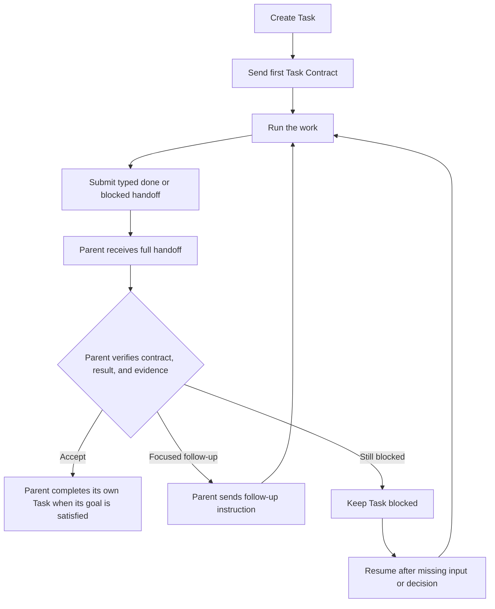

# Task Manual

This is a field guide to using Tasks well. It describes the principles and
mental model behind Task coordination, not the detailed MCP tool contract. See
[Task Examples](task-examples.md) for short usage patterns and [Task MCP Control
Plane](task-mcp.md) for tool names, inputs, and boundaries.

## What a Task is

A Task is a bounded unit of work with its own context, lifecycle, working
location, and place in a Task tree. A Task may be handled by one Agent or by a
workflow that involves several Agents. Task and multi-agent are not synonyms.

Use a Task to give a piece of work a meaningful boundary. Do not create child
Tasks merely because the mechanism exists.

## Start with one Task

The default shape is:

```text
one problem → one Task → one clear completion condition
```

Keep work in one Task when it is sequential, shares context, or is small enough
for one Agent to handle directly. A clear Task should state its goal, scope,
non-goals, and what counts as complete.

## Delegate only when there is a reason

Create child Tasks when the work benefits from one or more of these properties:

- independent investigation;
- context isolation;
- parallel progress;
- a separate responsibility or owner;
- a different execution policy.

Give each child one bounded responsibility. The parent should retain the
problem boundary and the completion condition; the child should own its local
work.

A child creation normally has two conceptual steps: create the Task, then give
it its first instruction. The instruction should provide enough context for the
child to work without repeatedly asking what it is supposed to do.

## The Task lifecycle

A Task has two related lifecycles: execution and acceptance. The Agent owns
execution; the parent or user decides whether the submitted result is accepted.
The normal delegated shape is:



`task_update(done, ...)` means that the current Agent is submitting its result;
it does not prove that a parent has accepted the result. The handoff should
include the conclusion, satisfied criteria, evidence, limitations, and a next
step when useful. `task_update(blocked, ...)` should name the missing input or
decision and explain how the Task can resume.

`task_send` is for ordinary coordination, questions, progress, and follow-up;
it is not a terminal lifecycle handoff. A Task may send useful information and
still need to continue or later submit `done` or `blocked`.

A Task created by an Agent as a delegated child follows the handoff contract.
A user-created interactive Task remains a user-controlled workspace: it can
receive collaboration messages and important results, but the runtime does not
automatically require a lifecycle handoff after each turn.

After a parent accepts a result, the Task remains available for history and
follow-up. A retrospective may be recorded after acceptance, but it is not a
prerequisite for accepting the result. If a delegated turn ends without a
typed handoff, WebAgent may send one automatic Markdown reminder; this is a
recovery aid, not a substitute for the Agent's typed handoff.

## Communicate through messages

Use messages as the normal coordination path. A Task should send useful
progress, questions, findings, and decisions to the relevant Task as they arise.
Use `task_update` when the current assignment becomes materially blocked or
complete; its status is a typed message, not Task deletion. A final result
should include the conclusion and the evidence needed by the recipient to act
on it. The recipient receives the full handoff body, including important
findings; it should summarize rather than blindly forward a child's raw report.

Task coordination is event-driven:

```text
send or complete a handoff
        ↓
recipient receives a delivery
        ↓
recipient continues or makes a decision
```

A parent should not repeatedly inspect a child while waiting for its result.
Once work has been dispatched, end the current turn and let the completion or
blocking message bring the next decision back to the coordinator. If a
collaboration delivery contains a child result, the parent handles that result
locally; WebAgent does not automatically broadcast the raw handoff to every
ancestor. A parent sends its own summary upward only when its own Task is ready
to report.

## Use lifecycle states deliberately

Use the lifecycle to communicate material state, not ordinary progress. These
states describe the current execution record; `done` and `blocked` do not
remove the Task or prevent a later continuation:

- **running** — work is in progress;
- **idle** — no turn is currently running; this does not prove completion;
- **blocked** — the current work cannot continue without a decision or missing input;
- **done** — the current assignment is complete and its result has been handed off.

`task_update` is the typed lifecycle handoff for `blocked` and `done`; use
`task_send` for ordinary progress, findings, and decisions. A blocked or done
state does not delete or permanently close the Task. Its history remains
available, and a later `task_send` can continue or resume it.

A blocked Task should explain what it needs and what will happen after it gets
that input. The parent resumes it by sending the decision or information. A
blocked state is not a reason to poll, and a done state should not be used for
an intermediate update. Create a new Task for follow-up work only when it
needs a separate boundary, context, owner, or execution policy.

## Let Tasks contribute at the right level

The parent provides direction and resolves questions that cross boundaries.
Children provide focused work and evidence. Sibling Tasks may exchange ideas,
questions, and critiques when they are working on the same problem.

Keep independent analyses independent when diversity of thought matters. Share
findings when another Task can use them to test an assumption, find a counter-
example, or develop a better solution. Coordination should improve the work,
not turn every Task into a shared stream of unrelated conversation.

## Put evidence at the boundary

A handoff is most useful when it carries a compact, verifiable result:

```text
conclusion
→ evidence
→ limitations
→ suggested next step
```

For code, identify the relevant file, symbol or line range, observed behavior,
and causal mechanism. Prefer references and concise explanations over copying
large files or entire transcripts.

History inspection is an exception path, but it also applies to the current
Task. Task history is persisted in the database and is not compacted or cleared.
The word `compact` has two separate meanings here: `task_query` returns a
compact projection of history, while `/compact` changes the active model
context. Likewise, `/clear` rotates the active execution while keeping the
Task's history.

After `/compact` or `/clear`, use `task_query` without a target to read the
current Task's persisted history, then use `task_get_record` for one specific
event when the compact entry is not enough. These tools expose stored events;
they do not recreate hidden model reasoning or silently restore the old model
context. Do not make history queries the normal way of passing results between
Tasks.

## Keep the workflow proportional

More Tasks and more turns do not automatically produce better work. Before
splitting, ask whether the expected gain from another context or perspective
outweighs its coordination cost.

Stop when the completion condition is met. If work is not converging, make the
uncertainty explicit, narrow the next question, or ask for a stronger decision
rather than adding open-ended iterations.

## A compact mental model

```text
Task boundary
  → clear responsibility
  → message-based coordination
  → explicit handoff
  → evidence-backed decision
```

The Task tree is a structure for boundaries and delivery. It is not a reason to
centralize every thought in the parent, and it is not a global message bus.

## Quick checklist

Before starting:

- What single problem does this Task own?
- What is the completion condition?
- Can one Agent finish it directly?
- If delegation helps, what independent responsibility belongs in each child?

During work:

- Are messages going to the Task that can act on them?
- Is the parent allowing children to work independently where appropriate?
- Is a blocked state asking for an actionable decision?
- Is anyone polling instead of waiting for delivery?

Before finishing:

- Is the result explicitly marked done?
- Does the handoff contain the conclusion and its evidence?
- Are limitations and unresolved questions visible?
- Has the workflow stopped because the goal is complete, rather than because it
  ran out of turns?
