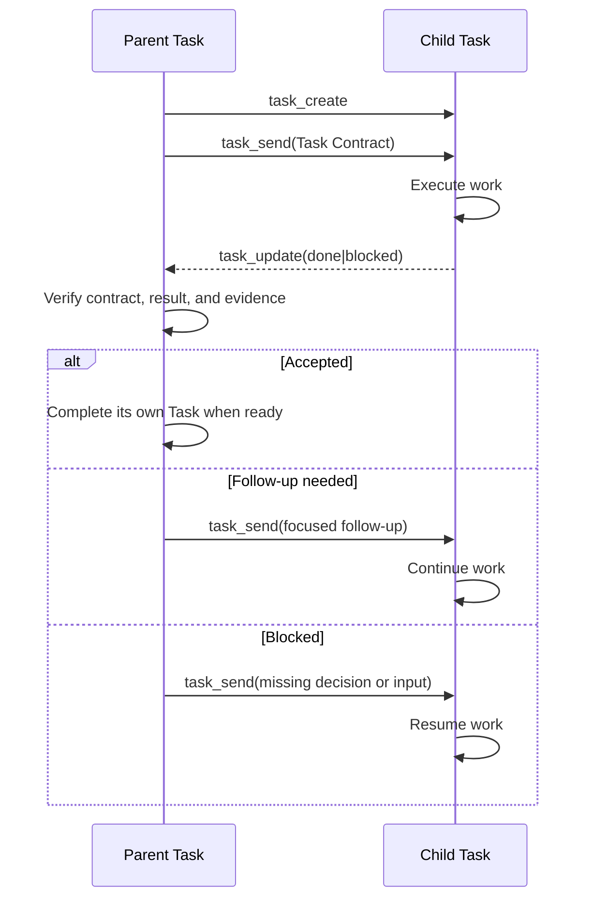

# Task MCP Control Plane

WebAgent injects a `webagent` MCP server into each compatible ACP session. It
lets an agent inspect and coordinate with tasks in its local task family without
granting access to unrelated tasks.

This document is the tool reference. For the user-facing principles and
examples, see the [Task Manual](task-manual.md) and [Task Examples](task-examples.md).

## Scope and authentication

The server is a Streamable HTTP endpoint at `/mcp`. Each ACP session receives a
fresh capability token; WebAgent sends it as an `Authorization: Bearer` header.
A capability is scoped to one task, is checked before MCP protocol handling, and
can access only that task plus its parent, direct children, and siblings.

The server is additive. It does not replace an agent's own MCP configuration or
native tools.

## How the server reaches the agent

WebAgent does not write an agent's MCP configuration files. It attaches the
server to the ACP session request — `session/new` and `session/load` — through
the protocol's `mcpServers` field, which carries standard transport
descriptions (`stdio`, `http`, `sse`). Putting those definitions to work is the
agent's own MCP implementation. One thing is required of it; the other is only
a preference:

- Required: forward the session's `mcpServers` into its own MCP stack. An agent
  that ignores the field never sees this server.
- Preferred: expose the discovered tools to the model directly instead of behind
  a generic proxy step. WebAgent expresses that with `_meta.directTools: true`
  on the server entry.

The preference is not a requirement. `_meta` is where the protocol reserves
exactly this kind of non-standard note, and it forbids implementations from
assuming anything about the values there, so ignoring the hint is a normal
outcome rather than a failure: the tools still work, they simply surface the way
that agent exposes MCP tools. A presentation preference like this has no
standard field by design — MCP describes what a server offers, not how a client
presents it — so whether tools are registered directly or reached through a
proxy stays the client's or agent's choice.

Neither is required for the session itself: MCP is separate from the rest of the
session. An agent that cannot attach these servers still serves the user
normally — chat, files, permissions, and other tools are unaffected — it simply
has no task tools, and the client does not treat the failure as fatal.

The definitions are per session, which is also why this entry cannot live in a
static MCP configuration file: the endpoint carries a capability token minted
for one task. Which agents put the definitions to use is noted in
[Configuration & Operations](configuration.md#acp-compatible-agents).

## Server instructions

The server advertises a short, generic usage contract through the MCP
`initialize` result:

```text
Use task_create for a direct child, then immediately use task_send to give it its first instruction.
Use task_list to check each reachable Task's workflowStatus, executionState, lastEventAt, and lastAgentActivityAt before deciding to act; workflowStatus is per turn, not a lifecycle terminal, and executionState is the live runtime source.
Use task_send for normal coordination and for continuing or resuming existing Tasks; task_send is not a lifecycle handoff. Use task_update(done|blocked) for typed lifecycle handoffs. A done Task remains available and is not deleted or permanently closed.
task_update(done|blocked) settles the directed obligation when it comes from the current eligible turn; there is no correlation parameter to copy back.
After dispatching work, end the current turn; do not poll with task_query.
Use task_query and task_get_record only for history recovery, diagnosis, or audit.
Omit task_id to inspect the current Task's persisted history.
```

Clients may surface these instructions through their own discovery UI or tool;
they are not a replacement for the individual tool descriptions.

### Directed dispatch closure

An accepted **agent-authored direct parent→child dispatch** creates one
directed obligation: a process-local record that the source is awaiting one
account from that target. The runtime decides this at the collaboration-message
boundary with the pure policy
`message.source_actor === "agent" && target.parent_id === source.id`. A user
send (including a human message in the parent session), a sibling or child
message, an account, and a runtime outcome notice never arm an obligation. The
policy is derived from data the rows already carry: there is no classification
field at message creation and no body inspection.

There is **no correlation token**. A target has one direct parent, so the
target's sole record is unambiguous; a plain `task_update(status, body)` decides
settlement from the record and the caller's turn. The record is still not an
intent or expectation control. There is no expectation level, no
per-counterparty ledger, and no separate lifecycle status beyond the existing
`running`/`idle`/`blocked`/`done` report.

**Settlement predicate.** A record settles only when both hold:

1. its state is `open`, `reminder_due`, or `reminder_submitting`;
2. the target has an active current agent turn.

It is refused without settling when the state is `awaiting_delivery`,
`unanswered`, or `settled`, or when no agent turn is active.

There is deliberately **no timestamp guard**. The delivery turn is added to the
runtime's active prompts and stamped before `bridge.prompt` is issued, while
the record opens only when that prompt resolves, so comparing the turn's start
against dispatch acceptance would reject the legitimate dispatch account. Any
future proposal to add such a guard must account for that ordering.

**Routing.** A settleable record is one atomic step: the update is persisted,
the reported `workflow_status` changes, the account message is created to the
**stored source**, the record becomes `settled`, and its timers are cancelled. A
record that exists but is not settleable still routes its account to the stored
source without settling, so a terminal `unanswered` record is never re-settled
and its earlier notice is never retracted. With no record for the target, the
update is an ordinary report to the caller's **current parent** and settles
nothing.

**Accepted residual.** Settlement is judged from the *current* turn, not from
the turn that produced the content. A call delayed from an earlier turn that
arrives while a later eligible turn is current therefore settles the record and
the source receives the earlier turn's content: a mis-attributed account, not
silence. That is a deliberate boundary, not a bug.

If a dispatch turn ends without an account, the controller submits up to three
delivered closing reminders: one at the turn boundary, one two minutes after
the previous delivered reminder, and one five minutes after that. A rejected
submission never consumes a delivered attempt: it is retried with backoff while
the target is idle, and three consecutive submission failures end the edge with
a factual `no_account` notice carrying `delivery_unavailable` evidence. A
rejected **initial** dispatch is retried the same way instead of being
abandoned. When the last delivered reminder completes without an account the
edge becomes `unanswered` and the source receives exactly one `no_account`
notice; a later account is still routed to the stored source.

The `no_account` notice is a `task_outcome_notice` collaboration message with a
system actor, routed target→stored source, carrying `sourceTaskId`,
`targetTaskId`, `openingMessageId`, `openingDeliveryId`, `reason`, and
`evidence`. It cannot arm an obligation. The watchdog is independent: while a
target turn with an active record runs, a quiet stretch of
`SILENCE_THRESHOLD_S = 900` emits one heuristic `no_activity` notice per
target×turn, never changes obligation state, and shares no limiter with the
exhaustion notice.

Obligation state is process-local runtime memory. It is not persisted, does not
survive a restart, and carries no cross-restart recovery promise.

Detailed workflow guidance belongs in
the [Task Manual](task-manual.md) or an on-demand skill.

## Lifecycle at a glance

The MCP surface participates in this loop:



`task_send` does not complete the current Task. A `done` Task remains available
for history and follow-up. Parent Tasks receive direct child handoffs only;
WebAgent does not automatically rebroadcast raw child reports to ancestors.

## Tools

| Tool | Purpose |
| --- | --- |
| `task_list` | List the current task and its locally reachable parent, children, and siblings, each with `workflowStatus`, `executionState`, `lastEventAt`, and `lastAgentActivityAt` for triage. |
| `task_query` | Read a bounded, compact history page for the current task or one visible relative. |
| `task_get_record` | Read one complete persisted history record by task-local sequence. |
| `task_cancel` | Stop the current execution of a child Task while preserving its history. |
| `task_create` | Create a direct child Task with optional execution overrides. Use `task_send` for its first instruction. |
| `task_send` | Send a durable coordination message, including follow-up or resume instructions for an existing Task. Use `task_update` for typed `blocked`/`done` status. |
| `task_update` | Send a typed `blocked` or `done` lifecycle account for the current Task. A plain `(status, body)` call settles the directed obligation when it comes from an eligible current turn; there is no correlation parameter. This does not delete or permanently close the Task. |

### `task_list`

Takes no arguments and returns the current Task plus every locally reachable
parent, child, and sibling. The whole family gets the same fields, with no
special-casing. Ordering is relation-then-id (`self`, `parent`, `child`,
`sibling`) and is deliberately not status-sorted, so the caller reads the
statuses instead of inheriting a second prioritization policy.

```ts
type McpTaskListItem = {
  id: string;
  title: string;
  relation: "self" | "parent" | "child" | "sibling";
  workflowStatus: "running" | "idle" | "blocked" | "done";
  executionState: "idle" | "agent" | "bash";
  lastEventAt: string | null;
  lastAgentActivityAt: string | null;
};
```

`workflowStatus` uses the same vocabulary as `task_query`'s `workflowStatus`.
It is **per turn, not a lifecycle terminal**: a `done` Task can be woken by a
later message and run again, so `done` means the Task reported complete for that
turn, not that it is finished forever. Use `task_list` to decide whether to act
on a Task; use `task_query` only for history recovery or diagnosis, not to poll.

`executionState` is the live runtime source: `agent` while an ACP turn or a
collaboration delivery is running, `bash` while a user shell command owns the
Task, and `idle` otherwise. It is execution telemetry, not a quality signal, and
it is deliberately separate from `workflowStatus`, which is only the last typed
report.

`lastEventAt` is the `created_at` of the Task's most recent persisted event, any
type — the Task's own activity clock, not its user-visible `last_active_at`.
It uses the same representation as other MCP timestamps: SQLite
`strftime('%Y-%m-%d %H:%M:%f', 'now')` output, for example
`2026-09-13 21:05:03.123`, in **UTC with no timezone marker**. It is `null` when
the Task has no persisted events yet. A stale `lastEventAt` next to
`workflowStatus: "running"` is a **lag signal, not proof of work**: a long
silent tool call can look stale while the Task is still running.

`lastAgentActivityAt` is an ISO-8601 timestamp of the Task's latest qualifying
agent-runtime event (assistant or thinking chunks, tool calls, plans, or
permission requests), or `null` when none has been observed. Unlike
`lastEventAt`, it ignores user and system events, so a running turn with no
agent activity is a silence signal rather than an activity claim.

### `task_query`

All input fields are optional:

```ts
{
  task_id?: string; // Visible target task; current task when omitted
  text?: string;    // Literal search term in underlying stored event data
  cursor?: string;  // Opaque cursor from a prior response
  limit?: number;   // 1–100; defaults to 5
}
```

For provider compatibility, each optional field also accepts `null`, which has
exactly the same meaning as omission. MCP clients should normally omit unused
fields.

#### Provider schema compatibility

Some function-calling providers emit every property in a tool schema even when
fields are optional. Without a nullable alternative, they may invent placeholder
values for `task_id` or `cursor`, causing lookup or pagination failures.

For that reason, every optional `task_query` field also accepts `null`, and the
server treats `null` exactly like omission. The fields remain optional for MCP
clients that already handle the schema correctly.

Without arguments, the tool examines the latest five non-thinking events from
the current task. Normal completion events are omitted, so a returned page may
contain fewer records. A query selects the latest matching events and returns
that page in chronological order. `nextCursor`, when present, reads older
events. Search is literal database matching against the original stored
payload; it is not a semantic or full-text query.

The current Task's persisted history remains available after context
compaction or `clear`, so omitting `task_id` is also the way to recover earlier
context for the current Task. The history itself is not compacted by
`task_query`: that tool only returns a compact projection. `/compact` changes
the active model context, while `/clear` rotates the active execution and keeps
the Task's history. These tools expose stored events; they do not restore
hidden reasoning or automatically rebuild the previous model context.

```ts
{
  workflowStatus: "running" | "idle" | "blocked" | "done";
  records: CompactTaskHistoryRecord[];
  hasMore: boolean;
  nextCursor?: string;
}

type CompactTaskHistoryRecord = {
  seq: number;
  type: string;
  createdAt: string;
  text: string;
  truncated?: true;
  rawSize?: number;
};
```

`seq` is the event's stable sequence within its task. It is included as an
identity/reference value; pass it to `task_get_record` when the compact
projection is not enough.

### Compact history records

Task history remains stored as raw JSON events in SQLite. `task_query` does not
return that `data` field: tool inputs and results can contain entire source
files, diffs, or command output and would consume an agent's context budget.
Instead, it deterministically extracts a small plain-text representation based
on the event type. It does not invoke an LLM or alter the stored event.

| Event type | Included information |
| --- | --- |
| `user_message`, `assistant_message` | Message text and attachment count where applicable. |
| `tool_call` | Tool title, kind, and a bounded command or path when available. |
| `tool_call_update` | Tool title, status, bounded result text, and a bounded command or path when available. |
| `plan` | Each plan entry's status and content. |
| `permission_request`, `permission_response` | Permission title and choices, or allow/deny outcome. |
| `error` | Error message. |
| `system_message` | Message title and optional body; collaboration/task details use both fields. |
| `task_update`, `task_cancel`, `message` | Collaboration route/status and message body. |
| `bash_command`, `bash_result` | Command, exit code/signal, and bounded output. |
| `prompt_done` | Non-normal stop reasons only; ordinary `end_turn` is omitted as noise. |

Unknown event types and malformed payloads remain visible as a short notice
with `rawSize`; they are not silently discarded. Thinking events are excluded.

Text is capped at 800 characters per record; embedded tool result and command
or shell-output excerpts are capped at 400 characters before being placed in
the record. When text is shortened, `truncated: true` is set and `rawSize`
reports the UTF-8 size of the original event payload. A tool input such as a
large edit diff may be represented only by its title and target path even when
the resulting text itself does not need truncation.

This compact view is intended for normal task coordination. Raw events are
retained for the browser transcript and explicit diagnostic lookup; they are not
sent through `task_query`.

### `task_get_record`

Use this tool to expand exactly one `seq` returned by `task_query`:

```ts
{
  task_id?: string; // Visible target task; current task when omitted
  seq: number;      // Positive event sequence within that task
}
```

The response contains the complete WebAgent-persisted event row:

```ts
{
  taskId: string;
  record: {
    id: number;
    taskId: string;
    seq: number;
    type: string;
    data: string;      // Exact JSON string stored in SQLite
    fromRef: string;   // Persistence origin marker
    createdAt: string;
  };
}
```

`data` is not compacted, parsed, summarized, or rewritten. This is the complete
stored event record, not necessarily the complete original ACP notification.
The `fromRef` field is persistence metadata, not an ACP field; clients should
treat it as an opaque string.

The tool reads one record per call and does not support bulk sequence lookup, so
full payload expansion remains explicit and bounded by the caller's choice.

### `task_cancel`

Stop the current execution of a child Task without deleting or retiring the
Task. The Task and its history remain available. The request records a required
reason and uses the existing asynchronous cancellation result states:
`idle`, `cancelling`, `cancelled`, or `superseded`.

The MCP caller may cancel only a direct child Task. Cancellation does not
change the Task into `done`; normal completion uses `task_update` instead. The
configured cancellation safety timeout is shared with the REST cancel path;
when the Agent has not acknowledged cancellation, the result remains
`cancelling` and the runtime exposes the unconfirmed state rather than claiming
that execution has stopped.

### `task_create`

Create a direct child Task immediately. The request includes a required title
plus optional `cwd`, `model`, and `thinking` overrides. Omitted execution
options inherit from the current Task. The result contains the new Task ID.
This creates an Agent-delegated Task: immediately send its first Task Contract
with `task_send`, including the goal, scope, completion criteria, and report
format, then end the dispatch turn without polling. Failures return an MCP tool
error rather than an empty ID.

### `task_send`

Send a durable coordination message to another Task. Use it for instructions,
questions, findings, progress, decisions, and focused follow-up, including
continuing a Task marked `blocked` or `done`.

`task_send` is not a lifecycle handoff and does not complete the current Task.
Use `task_update(done|blocked)` when the current assignment is complete or
cannot continue. The recipient receives the full message body; important
findings are not discarded because the message is coordination.

### `task_update`

Submit a typed lifecycle account for the current Task:

```ts
task_update(status: "blocked" | "done", body: string)
```

- `blocked`: explain the missing input or decision and how the Task can resume;
- `done`: provide the result, completion evidence, limitations, and useful next
  step.

There is **no new parameter**. The runtime identifies the target's sole directed
obligation itself and settles it only from an eligible current turn: the record
must be `open`, `reminder_due`, or `reminder_submitting`, and the target must
have an active agent turn. A settleable call is one atomic step that records the
update, changes the reported status, creates the account to the **stored
source**, and cancels the record's timers.

When a record exists but those conditions do not hold — `awaiting_delivery`, a
terminal `unanswered`/`settled` record, or no active turn — the update is still
recorded and routed to the stored source, without settling. When no record
exists for the target, the update is an ordinary report to the current parent
and settles nothing. A terminal record is never re-settled and its earlier
`no_account` notice is never retracted.

There is deliberately no timestamp guard, because the delivery turn is stamped
before `bridge.prompt` is issued while the record opens only when it resolves;
comparing the two would reject the legitimate dispatch account.

Because settlement is judged from the current turn, a call delayed from an
earlier turn that arrives while a later eligible turn is current settles the
record and the source receives the earlier turn's content. That is an accepted
boundary, not a bug.

A `done` account is a result submission, not proof that the parent has accepted
it. The parent or verifier checks the original Task Contract and may accept it,
request focused follow-up with `task_send`, or keep it blocked. The Task and its
history remain available after either status.
