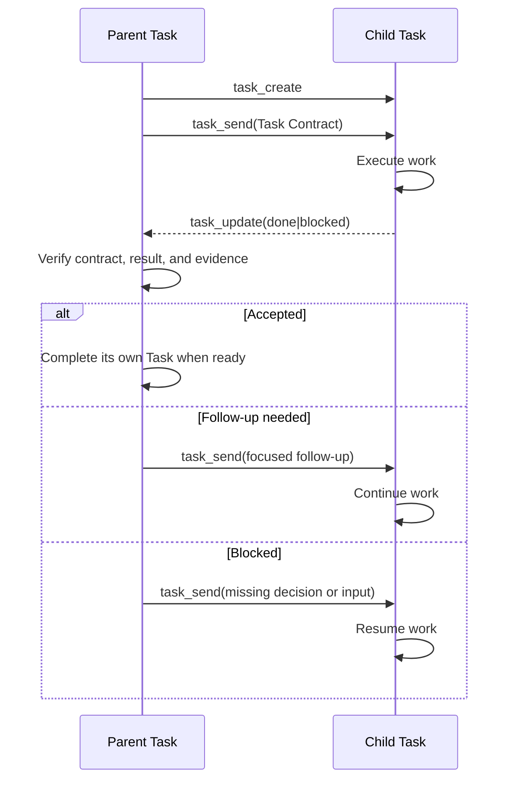

# Task MCP Control Plane

WebAgent injects a `webagent` MCP server into each compatible ACP session. It
lets an agent inspect and coordinate with tasks in its local task family without
granting access to unrelated tasks.

This document is the tool reference. For the user-facing principles and
examples, see the [Task Manual](task-manual.md) and [Task Examples](task-examples.md).

## Scope and authentication

The server is a Streamable HTTP endpoint at `/mcp`. Each ACP session receives a
fresh capability token; WebAgent sends it as an `Authorization: Bearer` header.
A capability is scoped to one task, is checked before MCP protocol handling, and
can access only that task plus its parent, direct children, and siblings.

The server is additive. It does not replace an agent's own MCP configuration or
native tools.

## How the server reaches the agent

WebAgent does not write an agent's MCP configuration files. It attaches the
server to the ACP session request — `session/new` and `session/load` — through
the protocol's `mcpServers` field, which carries standard transport
descriptions (`stdio`, `http`, `sse`). Putting those definitions to work is the
agent's own MCP implementation. One thing is required of it; the other is only
a preference:

- Required: forward the session's `mcpServers` into its own MCP stack. An agent
  that ignores the field never sees this server.
- Preferred: expose the discovered tools to the model directly instead of behind
  a generic proxy step. WebAgent expresses that with `_meta.directTools: true`
  on the server entry.

The preference is not a requirement. `_meta` is where the protocol reserves
exactly this kind of non-standard note, and it forbids implementations from
assuming anything about the values there, so ignoring the hint is a normal
outcome rather than a failure: the tools still work, they simply surface the way
that agent exposes MCP tools. A presentation preference like this has no
standard field by design — MCP describes what a server offers, not how a client
presents it — so whether tools are registered directly or reached through a
proxy stays the client's or agent's choice.

Neither is required for the session itself: MCP is separate from the rest of the
session. An agent that cannot attach these servers still serves the user
normally — chat, files, permissions, and other tools are unaffected — it simply
has no task tools, and the client does not treat the failure as fatal.

The definitions are per session, which is also why this entry cannot live in a
static MCP configuration file: the endpoint carries a capability token minted
for one task. Which agents put the definitions to use is noted in
[Configuration & Operations](configuration.md#acp-compatible-agents).

## Server instructions

The server advertises a short, generic usage contract through the MCP
`initialize` result:

```text
Use task_create for a direct child, then immediately use task_send to give it its first instruction.
Use task_list to check each reachable Task's workflowStatus, executionState, lastEventAt, and lastAgentActivityAt before deciding to act; workflowStatus is per turn, not a lifecycle terminal, and executionState is the live runtime source.
Use task_send for normal coordination and for continuing or resuming existing Tasks; task_send is not a lifecycle handoff. Use task_update(done|blocked) for typed lifecycle handoffs. A done Task remains available and is not deleted or permanently closed.
task_update(done|blocked) settles the directed obligation when it comes from the current active turn; there is no correlation parameter to copy back.
After dispatching work, end the current turn; do not poll with task_query.
Task history is the event log; summaries and handoffs are self-reports, and the log outranks them.
Use task_query to index flat event history and task_read to recover complete rows; use them only for history recovery, diagnosis, or audit.
Omit task_id to inspect the current Task's persisted history.
```

Clients may surface these instructions through their own discovery UI or tool;
they are not a replacement for the individual tool descriptions.

### Directed dispatch closure

When an agent-authored parent Task dispatches work directly to a child Task, the
runtime keeps one process-local obligation for that edge and reports its outcome
to the source: the child's typed account, or a factual notice that the runtime
stopped its own attempts without one. A notice is not a verdict — a late account
still settles the edge. It records and reports
facts — a dispatch was handed over, a turn ended, a request was rejected, a timer
elapsed, delivery failed — and never turns them into a conclusion about the work.
The full mechanism, identities, state machine, budgets, and notices are in
[Task Obligations](task-obligations.md); the semantic boundary is in
[Task semantic authority](implementation-invariants.md#task-semantic-authority).

One process-local record exists per accepted direct source→target edge, driven
exclusively by named facts through a single `apply(fact)` transition point. The
record opens when the dispatch is handed to the target's session, settles from an
active current turn, and otherwise reaches a factual notice after bounded
recovery. There is no correlation token and no new parameter on `task_update`.

## Lifecycle at a glance

The MCP surface participates in this loop:



`task_send` does not complete the current Task. A `done` Task remains available
for history and follow-up. Parent Tasks receive direct child handoffs only;
WebAgent does not automatically rebroadcast raw child reports to ancestors.

## Tools

| Tool | Purpose |
| --- | --- |
| `task_list` | List the current task and its locally reachable parent, children, and siblings, each with `workflowStatus`, `executionState`, `lastEventAt`, and `lastAgentActivityAt` for triage. |
| `task_query` | Read a bounded, compact history page for the current task or one visible relative. |
| `task_read` | Read complete persisted history rows by task-local sequence from the current task or one visible relative. |
| `task_cancel` | Stop the current execution of a child Task while preserving its history. |
| `task_create` | Create a direct child Task with optional execution overrides. Use `task_send` for its first instruction. |
| `task_send` | Send a durable coordination message, including follow-up or resume instructions for an existing Task. Use `task_update` for typed `blocked`/`done` status. |
| `task_update` | Send a typed `blocked` or `done` lifecycle account for the current Task. A plain `(status, body)` call settles the directed obligation when it comes from an active current turn; there is no correlation parameter. This does not delete or permanently close the Task. |

### `task_list`

Takes no arguments and returns the current Task plus every locally reachable
parent, child, and sibling. The whole family gets the same fields, with no
special-casing. Ordering is relation-then-id (`self`, `parent`, `child`,
`sibling`) and is deliberately not status-sorted, so the caller reads the
statuses instead of inheriting a second prioritization policy.

```ts
type McpTaskListItem = {
  id: string;
  title: string;
  relation: "self" | "parent" | "child" | "sibling";
  workflowStatus: "running" | "idle" | "blocked" | "done";
  executionState: "idle" | "agent" | "bash";
  lastEventAt: string | null;
  lastAgentActivityAt: string | null;
};
```

`workflowStatus` uses the same vocabulary as `task_list`; `task_query` returns only `task_id`, `max_seq`, and flat event rows.
It is **per turn, not a lifecycle terminal**: a `done` Task can be woken by a
later message and run again, so `done` means the Task reported complete for that
turn, not that it is finished forever. Use `task_list` to decide whether to act
on a Task; use `task_query` only for history recovery or diagnosis, not to poll.

`executionState` is the live runtime source: `agent` while an ACP turn or a
collaboration delivery is running, `bash` while a user shell command owns the
Task, and `idle` otherwise. It is execution telemetry, not a quality signal, and
it is deliberately separate from `workflowStatus`, which is only the last typed
report.

`lastEventAt` is the `created_at` of the Task's most recent persisted event, any
type — the Task's own activity clock, not its user-visible `last_active_at`.
It is an ISO-8601 timestamp with an explicit `Z`, for example
`2026-09-13T21:05:03.123Z`. It is `null` when the Task has no persisted events
yet. A stale `lastEventAt` next to `workflowStatus: "running"` is a **lag
signal, not proof of work**: a long silent tool call can look stale while the
Task is still running.

`lastAgentActivityAt` is an ISO-8601 timestamp of the Task's latest qualifying
agent-runtime event (assistant or thinking chunks, tool calls, plans, or
permission requests), or `null` when none has been observed. Unlike
`lastEventAt`, it ignores user and system events, so a running turn with no
agent activity is a silence signal rather than an activity claim.

### `task_query`

List a flat index of persisted event rows for the current Task or one visible
relative. Thinking rows are included. The response is deliberately an index,
not a payload expansion; use `task_read` for exact event data.

```ts
{
  task_id?: string; // visible target; current task when omitted
  text?: string; // fixed string search; ASCII case folding only
  range?: [number, number]; // inclusive seq range; negative indexes use max_seq
}
```

Optional fields accept `null` as omission. With no range, all rows are
returned. Start recovery with `range: [-50, -1]`, then request older absolute
ranges. Ranges are normalized in either order and clamped to `[1, max_seq]`;
`[1, 0]` therefore returns only sequence 1 and must not be used as a
continuation request.

```ts
{
  task_id: string;
  max_seq: number;
  rows: Row[];
}

type Row = {
  seq: number;
  type: string;
  bytes: number;
  group?: string;
  title?: string;
  field?: string;
  text?: string;
  content_shape?: "unknown";
  unprojected?: true;
};
```

Rows are chronological and flat. `group` is the payload's tool call id
(`id` for tool rows, `toolCallId` for permission requests). `title` and `text`
are capped at 200 Unicode code points, with `…` marking each truncated side.
Known event types use deterministic projections. For `tool_call_update`, text
and terminal content projects as `content[]`, while a row made only of terminal
items names its anchor `content[0].terminalId`; diff items project their file
anchor as `content[0].path`, where `text` carries the path — every path joined
by newlines when a row holds several diff items — and `field` names the first
one's index. Neither diff body is indexed. An unrecognized content-item shape
is reported as `content_shape: "unknown"` alongside whatever recognized
siblings project, so an unknown item cannot erase a recognized one; when every
item is unrecognized the row carries `content_shape: "unknown"` and no text
rather than falling back to the status. Unknown event
types still appear with
`seq`, `type`, and `bytes`. Search scans decoded string leaves, not serialized
JSON, and returns the matching JSON path plus a centered window (radius 100).
It is fixed-string matching, not regular expression matching; only ASCII
letters are case-folded. The search term is limited to 128 code points so the
centered window always retains the complete match before allocating context.
An unprojected search hit carries `unprojected: true` so the reason for the hit
remains visible.

The serialized `{task_id, max_seq, rows}` response is subject to a 24 KiB
implementation limit — one index page is a decision aid, not a corpus, so the
cap sits just above the recommended 50-row window even when every row carries
its full 200-code-point text. Over-limit responses are rejected, never
partially returned, with a JSON tool error containing `response_too_large`,
`required_bytes`, `limit_bytes`, `max_seq`, and a tail-range hint.

### `task_read`

Read one or more complete persisted event rows by task-local sequence. This
is the sole complete-row history tool; no single-row alias is registered.

```ts
task_read({ task_id?: string, seqs: number[] })

{
  task_id: string;
  rows: Array<{
    seq: number;
    type: string;
    at: string; // ISO-8601 UTC with Z
    from: string;
    data: unknown; // complete decoded stored payload
  }>;
}
```

The target defaults to the current Task, so a Task that has just woken from
`/compact` or `/clear` reads its own history without first learning its id.

Duplicate sequences are removed and rows are returned in ascending order. Any
missing sequence rejects the whole request with
`{"error":"unknown_seq","missing":[...]}`. A batch is limited by an
implementation constant (128 KiB) together with an item-count limit; a single
sequence is exempt from both and answers to a separate 1 MiB single-row limit,
so one legitimate event is never permanently unreadable. Over-limit responses
are rejected without partial data and report `response_too_large` with the
exact `required_bytes`. That value is always
`Buffer.byteLength(JSON.stringify({task_id, rows}), "utf8")`.

Both history tools authorize only the current Task, its parent, direct children,
or siblings. Tombstones, nonexistent tasks, and out-of-family task IDs all
return `target_not_allowed`.

### `task_cancel`

Stop the current execution of a child Task without deleting or retiring the
Task. The Task and its history remain available. The request records a required
reason and uses the existing asynchronous cancellation result states:
`idle`, `cancelling`, `cancelled`, or `superseded`.

The MCP caller may cancel only a direct child Task. Cancellation does not
change the Task into `done`; normal completion uses `task_update` instead. The
configured cancellation safety timeout is shared with the REST cancel path;
when the Agent has not acknowledged cancellation, the result remains
`cancelling` and the runtime exposes the unconfirmed state rather than claiming
that execution has stopped.

### `task_create`

Create a direct child Task immediately. The request includes a required title
plus optional `cwd`, `model`, and `thinking` overrides. Omitted execution
options inherit from the current Task. The result contains the new Task ID.
This creates an Agent-delegated Task: immediately send its first Task Contract
with `task_send`, including the goal, scope, completion criteria, and report
format, then end the dispatch turn without polling. Failures return an MCP tool
error rather than an empty ID.

### `task_send`

Send a durable coordination message to another Task. Use it for instructions,
questions, findings, progress, decisions, and focused follow-up, including
continuing a Task marked `blocked` or `done`.

`task_send` is not a lifecycle handoff and does not complete the current Task.
Use `task_update(done|blocked)` when the current assignment is complete or
cannot continue. The recipient receives the full message body; important
findings are not discarded because the message is coordination.

### `task_update`

Submit a typed lifecycle account for the current Task:

```ts
task_update(status: "blocked" | "done", body: string)
```

- `blocked`: explain the missing input or decision and how the Task can resume;
- `done`: provide the result, completion evidence, limitations, and useful next
  step.

There is **no new parameter**. The runtime identifies the target's sole directed
obligation itself and settles it only from an active current turn: the record
must be `open`, `reminder_due`, `reminder_submitting`, or `unresolved`, and the
target must have an active agent turn. A settleable call is one atomic step that
records the update, changes the reported status, creates the account to the
**stored source**, and cancels the record's timers.

When a record exists but those conditions do not hold — `awaiting_delivery`, an
already-`settled` record, or no active turn — the update is still recorded and
routed to the stored source, without settling. When no record
exists for the target, the update is an ordinary report to the current parent
and settles nothing. A terminal record is never re-settled and its earlier
`no_account` notice is never retracted.

There is deliberately no timestamp guard, because the delivery turn is stamped
before `bridge.prompt` is issued and the record opens at hand-over; comparing
turn start against the hand-off time would reject the legitimate dispatch
account.

Because settlement is judged from the current turn, a call delayed from an
earlier turn that arrives while a later turn is current settles the
record and the source receives the earlier turn's content. That is an accepted
boundary, not a bug.

When a dispatch turn ends without an account, the runtime may inject a closing
reminder turn asking the target to close that turn out; its exact text and the
recovery contract are in [Task Obligations](task-obligations.md#what-a-target-does).

A `done` account is a result submission, not proof that the parent has accepted
it. The parent or verifier checks the original Task Contract and may accept it,
request focused follow-up with `task_send`, or keep it blocked. The Task and its
history remain available after either status.
