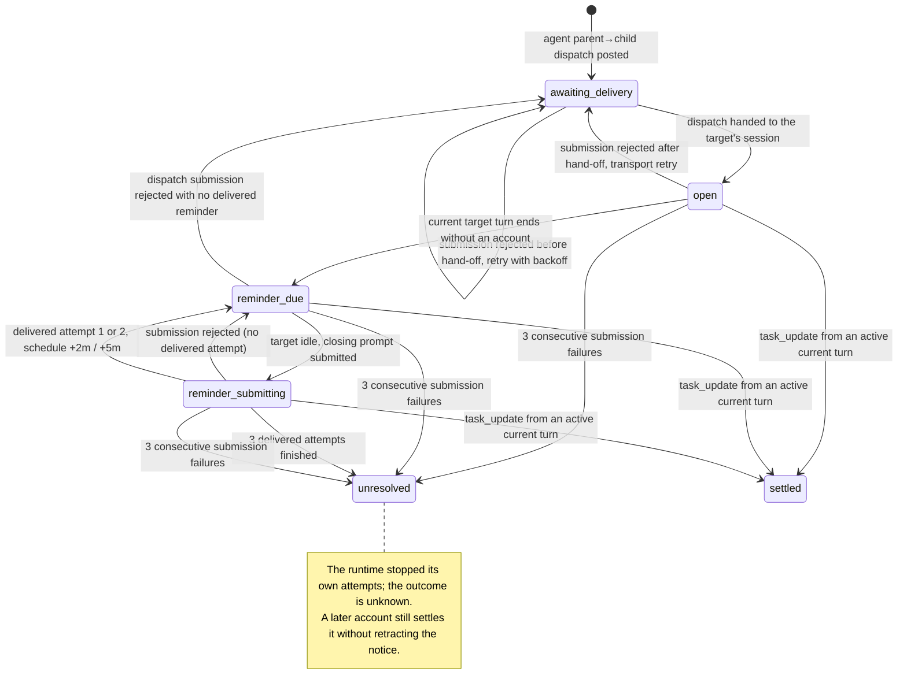

# Task Obligations

This document describes WebAgent's **directed-dispatch closure** mechanism: when
an agent-authored parent Task dispatches work directly to a child Task, the
runtime keeps one process-local obligation for that edge and reports its outcome
to the source: the child's typed account, or a factual notice that the runtime
stopped its own attempts without one. A notice is not a verdict — a late account
still settles the edge. The runtime records and reports facts; it never concludes
for the accountable party. The task-semantic principle behind that boundary is in
[Task semantic authority](implementation-invariants.md#task-semantic-authority).

## Purpose and semantic boundary

An **account** is the child's typed lifecycle report, `done` or `blocked`. The
one-account rule is: one accepted direct dispatch creates one obligation, and the
source stops waiting when either

- the child's typed account arrives, or
- one runtime notice reports that the runtime stopped its own attempts and the
  outcome is unknown — after which a late account still settles the edge.

The runtime supervises and keeps the books. It records that a dispatch was
handed over, that a turn ended, that a submission was rejected, that a deadline
passed, or that delivery failed, and it reports those facts with their evidence.
It never turns a fact into a conclusion about the work — not complete, not
failed, not abandoned, not worth continuing — and it never starts, continues, or
stops work on the accountable party's behalf. The accountable party is the
parent Task that dispatched the work; for a user-owned Task it is the user.

## When an account is owed

An obligation is armed only for an **agent-authored direct parent→child
dispatch**. The runtime decides this at the single collaboration-message
boundary with the pure policy (`src/task-collaboration.ts`):

```ts
message.source_actor === "agent" && target.parent_id === source.id
```

A user send (including a human message in the parent session), a sibling or
child message, a typed account, and a runtime outcome notice never arm an
obligation. The policy is derived from data the rows already carry: there is no
classification field at message creation and no body inspection.

**One observation seam.** A collaboration message created through
`Store.createCollaborationMessage` is reported exactly once after commit by
`CollaborationMessageEmitter` (`src/collaboration-emitter.ts`); the raw insert
is private to the Store, so no creation path can bypass the seam. `TaskManager`
registers the single observer and applies the arming predicate
(`src/task-manager.ts`). This is structural enforcement, not convention.

There is **no correlation token**. A target has one direct parent, so the
target's sole record is unambiguous and a plain `task_update(status, body)`
decides settlement from the record and the caller's turn. There is no
expectation level, no per-counterparty ledger, and no extra lifecycle status
beyond the existing `running`/`idle`/`blocked`/`done` report.

## What a target does

Submit a typed account for the current Task:

```ts
task_update(status: "blocked" | "done", body: string)
```

The tool contract and schema live in
[Task MCP Control Plane](task-mcp.md#task_update); there is no correlation
parameter to copy back.

A record **settles** when its state is `open`, `reminder_due`,
`reminder_submitting`, or `unresolved`, and the target has an active current
agent turn. Settlement is one atomic step: the update is persisted, the reported
`workflow_status` changes, the account message is created to the **stored
source**, the record becomes `settled`, and its timers are cancelled.

It is refused without settling when the state is `awaiting_delivery` (the
dispatch was never handed over) or `settled` (already resolved), or when no
agent turn is active. A record that exists but is not settleable still routes
its account to the stored source, without settling. With no record for the
target, the update is an ordinary report to the caller's **current parent** and
settles nothing. An `unresolved` record *does* settle on a late account, without
retracting the historical notice.

An account is a result submission, not proof that the parent accepted it. The
parent checks the original Task Contract and may accept it, request focused
follow-up with `task_send`, or keep it blocked. The Task and its history remain
available after either status.

**Closing reminder.** When a dispatch turn ends without an account, the runtime
may inject a closing turn. It is not a lifecycle verdict; it asks the target to
close *that* turn out and account for it. A target that receives it should not
begin new work as part of the closing turn.

```text
## Task Handoff Required

This is a runtime-injected closing turn: report what this turn established
and end it.

Do not begin new work as part of this closing turn.

Report what this turn established, then call exactly one of:
- `task_update(done, ...)` with the completion report.
- `task_update(blocked, ...)` and explain what is missing.

If the user cancelled this turn, say so plainly in that report instead of
resuming the cancelled work. Do not start new work, and do not end this turn
with a prose answer only.
```

## State, identities, and facts

There is one process-local record per accepted direct source→target edge, held in
an in-memory map and never persisted. A later dispatch replaces a record only
once that record is terminal.

**States.** `awaiting_delivery` (armed, not yet handed over), `open` (handed
over), `reminder_due`, `reminder_submitting`, `unresolved` (the runtime stopped
its own attempts; the outcome is unknown, and a late account still settles it),
and `settled` (resolved).

**Identities.** Three distinct names, deliberately not merged
(`src/obligation-controller.ts`):

- `attemptId` — hand-off ownership: the turn identity of the live dispatch
  attempt. Installed by an `attempt_begun` fact and kept across a coalescing
  follow-up. Dispatch-scoped facts must match it or they are no-ops.
- `turnId` — the observed target turn. Recorded by `turn_begun`; `turn_ended`
  rejects a boundary whose identity is present and differs. The comparison fails
  open when the fact carries no id (older stored events) or no turn was observed
  (an obligation armed mid-turn); see [Limits](#observability-lifetime-and-limits).
- `recoveryGeneration` — the recovery-budget generation. A coalescing follow-up
  bumps it, so an in-flight reminder resolution from the previous generation is
  ignored instead of spending the refreshed budget.

**Facts.** Every external event enters through `apply(fact)`. The complete
vocabulary:

| Fact | Identity | Effect |
| --- | --- | --- |
| `armed` | — (record-creating) | Create the record, or coalesce onto a live one; reset budgets and advisories. |
| `attempt_begun` | `attemptId` | Install dispatch hand-off ownership. |
| `handed_over` | `attemptId` | `awaiting_delivery`/`open` → `open`; cancel the queued advisory. |
| `dispatch_succeeded` | `attemptId` | Clear the transport failure streak. |
| `dispatch_failed` | `attemptId` | Return to `awaiting_delivery`; count a transport failure and retry, or end in `unresolved`. |
| `turn_begun` | `turnId` | Observe the target turn and start the watchdog. |
| `turn_ended` | `turnId` (optional) | A boundary: clear the watchdog, observe the end, and schedule recovery. |
| `turn_aborted` | — (cleanup-scoped) | Cancel the watchdog; the only emitter is the reset/restart path. |
| `agent_activity` | — (unattributable) | Reset the watchdog's activity clock. |
| `released` | — (lifecycle) | Purge records at either endpoint and cancel their timers. |
| `reminder_started` | `recoveryGeneration` | Enter `reminder_submitting`. |
| `reminder_resolved` | `recoveryGeneration` | Delivered-attempt or transport accounting. |
| `timer_due` | — (kind-scoped) | Dispatch a derived deadline (attempt, watchdog, or advisory). |
| `settle_requested` | — (target-addressed) | Apply the settlement predicate and route the account. |
| `disposed` | — (lifecycle) | Stop scheduling. |

**Invariants.** `apply(fact)` is the only place that mutates a record or arms or
cancels a timer; the record type is unexported and callers observe a read-only
view. There is one state-derived scheduler: the controller computes each
record's pending deadlines from state and arms a single timer for the earliest.
No timer's expiry decides an outcome — timers emit `timer_due`, and terminal
transitions come only from a real account or from bounded accounting of real
submission failures. The transition diagram:



## Delivery, settlement, and accepted boundaries

**Open at hand-over.** The record opens when the dispatch is handed to the
target's session, immediately after `ensureResumed` and the prompt call — not
when the prompt promise resolves. `bridge.prompt` resolves at the end of the
turn, after it emits `prompt_done`, so a resolution-time open would leave the
dispatch turn itself `awaiting_delivery` and refuse the account that turn
produces (`src/task-manager.ts`).

**No timestamp guard.** Deliberately, settlement does not compare the current
turn's start against the hand-off time. The delivery turn is stamped before the
prompt is handed to the bridge, so any such comparison would reject the
legitimate dispatch account. Do not reintroduce one.

**Accepted boundaries.** Settlement is judged from the *current* turn, not from
the turn that produced the content. A call delayed from an earlier turn that
arrives while a later turn is current therefore settles the record, and the
source receives the earlier turn's content — a mis-attributed account, not
silence. Closing this would need prompt-scoped transport attribution, which is
larger than the token echoing that was rejected.

**Coalescing.** A same-source follow-up while the record is live coalesces onto
it: the record, its `attemptId`, and its opening audit references are preserved,
the delivered-attempt and submission-failure budgets and the advisory anchors
are refreshed, and the recovery generation is bumped. The follow-up's message
joins the batch the live attempt will deliver. A fact carrying a stale identity
is a no-op and cannot mutate the record that replaced it.

## Recovery and notices (operator policy)

> The thresholds in this section are **operator policy set in advance**. They are
> hard-coded module constants, not exposed configuration, so changing one is a
> code change. They are not validated against usage data: they are the
> mechanism's current values, and the runtime never uses them to declare an
> outcome. The mechanism only reports facts.

**Initial delivery and transport retry.** A request-level prompt failure — the
request never reached the agent session — is a `PromptNotDeliveredError`, thrown
after the error event. It consumes the transport-failure budget and returns the
record to `awaiting_delivery` for a bounded retry under the attempt's identity.
An agent error *inside a delivered turn* emits an error event but resolves, so it
is not a transport failure. A resume failure consumes the same budget.

**Delivered reminders.** When a dispatch turn ends without an account, the
controller submits up to `MAX_REMINDER_ATTEMPTS` closing prompts: one at the turn
boundary, then delayed from the preceding **delivered** reminder. Only a resolved
`bridge.prompt` counts as a delivered attempt; a rejected submission is retried
with backoff and consumes the separate transport budget instead.

**Advisories.** A dispatch still queued at `DISPATCH_ADVISORY_MS` and a record
still without an account at `AGE_ADVISORY_MS` each emit one non-terminal
`still_waiting` notice per epoch. Both pending advisories are cleared on
settlement, exhaustion, or release. The record is unchanged and the accountable
party decides.

**Watchdog.** While a target turn with a non-terminal record is running, a quiet
stretch of `SILENCE_THRESHOLD_S` emits one heuristic `no_activity` notice per
target×turn. It never changes the record, never reminds the target, and never
cancels or retries. Its limiter is independent of the exhaustion notice, so
silence cannot suppress the factual `no_account` outcome. Runtime resets and
`bridge.restart` abort the watchdog, and a notice requires the observed turn to
still be live.

### Thresholds and budgets

| Constant | Value | Meaning |
| --- | --- | --- |
| `MAX_REMINDER_ATTEMPTS` | 3 | Delivered closing reminders before `unresolved`. |
| `REMINDER_DELAYS_MS` | 0, 2 min, 5 min | Delay before reminder *n* from the preceding delivered reminder. |
| `MAX_REMINDER_SUBMISSION_FAILURES` | 3 | Consecutive rejected submissions before `delivery_failed`. |
| `REMINDER_RETRY_BASE_MS` / `REMINDER_RETRY_MAX_MS` | 1 s / 60 s | Exponential backoff for a rejected or busy submission. |
| `DISPATCH_ADVISORY_MS` | 60 min | Still queued (not handed over) → `still_waiting`. |
| `AGE_ADVISORY_MS` | 4 h | No typed account → `still_waiting`. |
| `SILENCE_THRESHOLD_S` | 900 s | No qualifying agent activity → `no_activity`. |

### Notices

A notice is a `task_outcome_notice` collaboration message with a system actor,
routed target→stored source, carrying `sourceTaskId`, `targetTaskId`,
`openingMessageId`, `openingDeliveryId`, `reason`, `message` (the fact, safe to
show verbatim), and `evidence`. A notice cannot arm an obligation.

| Reason | When | Evidence shape | Recipient's action |
| --- | --- | --- | --- |
| `no_account` | Bounded delivered reminders finished without an account. | `deliveredAttempts`, `consecutiveSubmissionFailures`, `lastDeliveredAttemptAt`. | The outcome is unknown; the parent may follow up with `task_send` or `task_cancel`. A later account still settles. |
| `delivery_failed` | The transport bound was reached. | The above plus `deliveryUnavailable: true`. | The runtime could not deliver; the parent decides whether to re-dispatch or cancel. |
| `no_activity` | A running turn produced no qualifying activity for the threshold. | `runningSince`, `lastAgentActivityAt`, `promptId`. | Heuristic only; the parent may `task_cancel` a turn that looks stalled. |
| `still_waiting` | A dispatch advisory or age advisory elapsed. | `phase`, plus per phase: `not_handed_over` carries `waitingMs`; `no_account` carries `openForMs`, `deliveredAttempts`, `lastAgentActivityAt`. | The runtime is still waiting; the parent decides whether to keep waiting or cancel. |

## Observability, lifetime, and limits

**Audit trail.** Every drained collaboration prompt is persisted on the target as
a `collaboration_prompt` audit event: the batch message ids plus at most
**16 KiB** of the text. A larger batch records only a prefix and a
`truncated`/`rawSize` marker, so for an oversized prompt the prefix and its size
are provable, not the full rendered text. The closing reminder persists its own
full text as a `handoff_reminder` system message. Neither record participates in
the agent's control flow.

**Lifetime.** Obligation state is process-local runtime memory. It is not
persisted, does not survive a restart, and a fresh controller reconstructs no
records; there is no restart recovery and Tasks do not auto-start. Terminal
records stay in the edge-keyed map for late-account routing until a later
dispatch replaces them. Releasing a Task purges every record where it is either
endpoint and cancels their timers — hygiene, not deletion recovery.

**Limits.** These are named boundaries, not defects:

- The watchdog covers only a running target turn that already has a non-terminal
  obligation record. A user-started `/bash` runaway on a Task with no obligation
  is therefore unwatched, and a Task whose agent-runtime events carry no prompt
  id cannot attribute trailing activity to a turn; a superseded turn's late
  activity can extend the current turn's report-only silence window.
- A `delivery_failed` notice travels through the same collaboration delivery as
  any other message, so it cannot repair a dead bridge or reach a source that
  never consumes its queue.
- Resource limits — wall-clock caps, turn caps, depth, or fan-out admission —
  are unimplemented. If added, they belong at the execution or tool-call layer;
  the obligation mechanism reports facts and does not decide them.
- The `turn_ended` identity comparison fails open when the fact or the observed
  turn is unknown, so one stale boundary can pass in that window. Both
  production emitters are gated on the current turn, so this is defensive
  tolerance rather than a live hole.

## Verification and related documents

- [`TEST_SCENARIOS.md`](../TEST_SCENARIOS.md) maps the mechanism's coverage,
  including the controller unit tests, the real-path integration tests, and the
  structural checks that prove the single transition point and single scheduler.
- [Task Manual](task-manual.md) is the user-facing principles guide.
- [Task MCP Control Plane](task-mcp.md#task_update) is the tool contract.
- [Implementation Invariants](implementation-invariants.md) is the normative
  authority for the task-semantic boundary and the runtime invariants.
